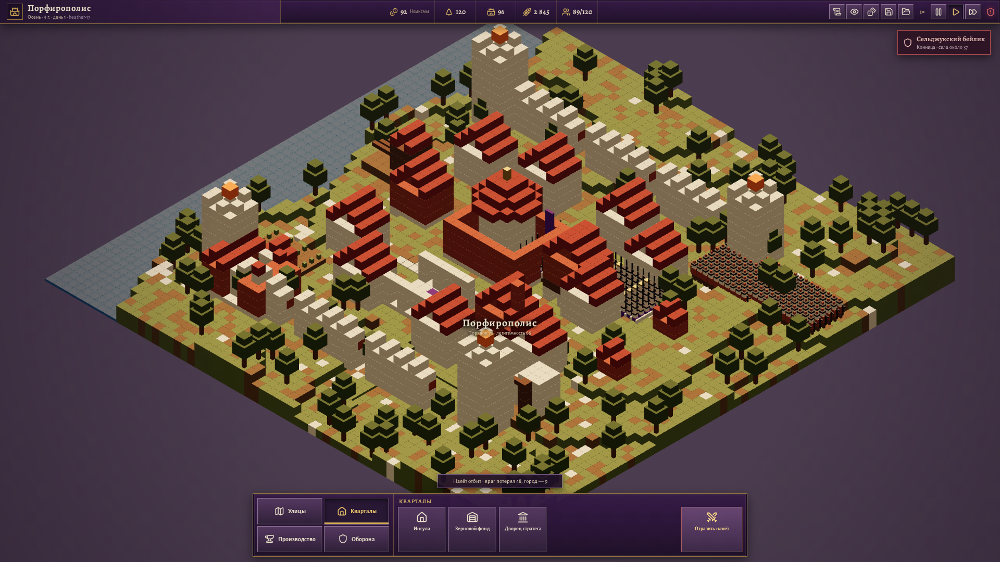

# OpenConstantinople

Играбельный браузерный вертикальный срез градостроя с элементами grand strategy и лёгким прямым управлением в духе OpenFront. Игрок развивает процедурный воксельный город, следит за хозяйством и устойчивостью власти, а во время набега может лично указать ополчению точку обороны.

Первый и пока единственный культурный пресет — византийский Порфирополис X–XI века. Его названия и оформление уже собраны отдельно от правил симуляции, но подключение других культур ещё потребует развязать оставшиеся прямые зависимости рендера.



## Что уже работает

- процедурная карта 64×64 со строгой ортографической изометрией;
- кодовая воксельная графика на Three.js без статичного фонового города;
- строительство домов, хозяйственных зданий, укреплений, дорог и стен;
- выбор, осмотр, ремонт и разбор городских объектов;
- население, ресурсы, производство пищи и прогноз запасов;
- голод, бунты и дворцовые перевороты с двумя вариантами решения;
- динамические внешние угрозы, которые появляются и исчезают в симуляции;
- видимый бой с пожарами и повреждением настоящих зданий;
- прямой приказ ополчению точкой на карте и более слабое авторазрешение при бездействии;
- стратегическая карта 8×8 с тремя нациями, правителями, дипломатией и территориальной войной;
- серверные комнаты, выбор свободной нации и синхронные походы между несколькими браузерами, включая отзыв рати ценой четверти войска;
- многопровинциальные маршруты через свои земли: сервер считает время по числу переходов, оба клиента видят один путь, а встречные вражеские колонны могут перехватить друг друга на маршрутном узле;
- автономные и незанятые игроками державы отдают те же походные приказы: их колонны видимы до боя, соблюдают ETA и разрешаются общим серверным march pipeline;
- предматчевое лобби с общей готовностью, единым серверным стартом и закрытым составом после начала войны;
- национальная казна, серверные дни, доход от земель и сбор ополчения;
- строительство владений по общему времени матча: посады, торги, укрепления и осадные дворы с разными экономическими и военными эффектами;
- походные и оборонительные построения с серверным контр-матчапом линии, стены щитов и клина;
- постоянные осады укреплённых владений: блокада, платные подкопы, решающий штурм, вылазка гарнизона и отход осаждающих;
- полевые манёвры вокруг осады: новые рати объединяются с лагерем, а защитник или воюющий союзник может идти на деблокаду;
- походные обозы: город и рынок дают запас дней осады, голод замедляет работы, а машины из осадного двора усиливают подкоп и штурм;
- двусторонние сетевые союзы: предложение остаётся нейтральным до явного принятия другим правителем;
- двусторонний мирный совет: военный счёт учитывает оккупацию, столицы и силы; победитель может потребовать одну приграничную провинцию, а второй правитель принимает или отклоняет условия;
- союзная помощь: правители передают казну напрямую и отправляют рать из выбранной провинции на соседний союзный рубеж;
- караванная торговля между соседними провинциальными рынками с общим ежедневным доходом и односторонними эмбарго;
- явные столицы, перенос двора после их падения, разгром державы при потере последней земли и общий победитель матча;
- локальные версионированные сохранения с положением камеры;
- поворот камеры, масштабирование и перемещение карты.

## Запуск

```bash
npm install
npm run dev
```

После запуска откройте `http://localhost:5173`.

Для сетевого матча во втором терминале запустите:

```bash
npm run server
```

## Управление

### Город

- Выберите раздел и постройку в нижнем доке, затем укажите место в мире.
- Дороги и стены прокладываются перетаскиванием ЛКМ.
- Без активного инструмента ЛКМ выбирает здание, а перетаскивание двигает карту.
- Колесо мыши меняет масштаб.
- `Q` и `E` поворачивают изометрию на 90°.
- `Escape` отменяет активный инструмент или приказ.

### Набег

1. Нажмите «Отразить налёт».
2. В боевом сообщении выберите «Ополчение».
3. Укажите точку обороны прямо на карте.

Строй направится к маркеру, а ручной приказ даст городу полноценную организованную оборону. Если не вмешиваться, через несколько секунд решение примет воевода — с худшим результатом против крупного налёта.

## Проверка

```bash
npm test
npm run typecheck
npm run build
npm run test:e2e
```

Стресс-сценарий запускается по адресу `http://localhost:5173/?stress=1`. После начала набега он выводит браузерные метрики в `window.__OPENFRONT_METRICS__`.

Текущий автоматизированный гейт проверяет только узкий боевой сценарий: 300 видимых бойцов, не менее 59 FPS и не более 24 draw calls. Последний локальный прогон в Playwright Chromium показал 59,7 FPS, p95 16,9 мс и 10 draw calls. Полный целевой сценарий с 600 зданиями или сегментами, 2 000 жителей и 20 пожарами отдельно пока не измерен.

## Архитектура

| Слой | Ответственность |
| --- | --- |
| `src/game/` | Детерминированная симуляция, экономика, кризисы, угрозы и сохранения |
| `src/renderer/` | Three.js-сцена, камера, picking, batching и метрики |
| `src/voxel/` | Генераторы рельефа, зданий и войск |
| `src/presets/` | Культурное оформление и названия игрового контента |
| Vue-компоненты | Компактный интерфейс и мост команд к игровому миру |

Мир рендерится через `InstancedMesh` и перерисовывается по требованию. Крупные наборы мировых сущностей не представлены Vue-компонентами и не помещаются в глубокое реактивное состояние.

## Статус

Это прототип вертикального среза, а не завершённая игра. Текущий курс — средневековый OpenFront: общая серверная карта наций, территориальная экономика и походы дополняются городским и тактическим микроменеджментом.
